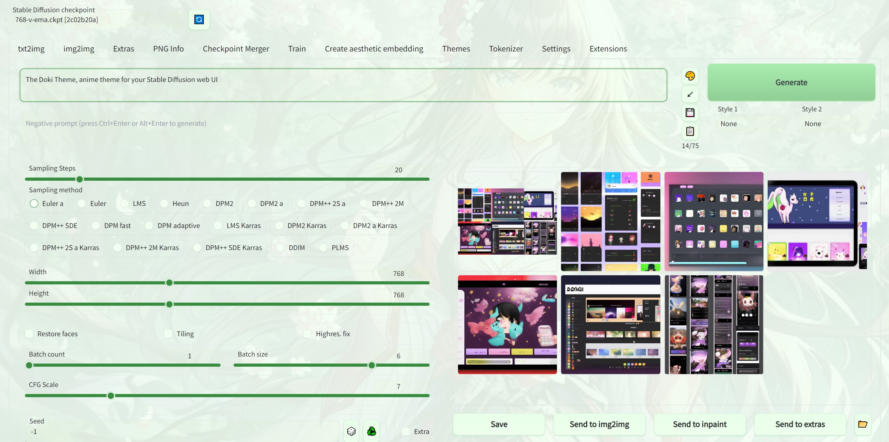

## stable-diffusion-webui-doki-theme

An extension for stable-diffusion-webui that lets you use a cute anime theme with a customizable background.

Themes ported from https://github.com/doki-theme/doki-theme-jupyter

If you like this, please check out the [Doki Themes](https://doki-theme.unthrottled.io/)! Cute anime theme for every programming tool.

### Usage

1. Put this repository in stable-diffusion-webui's extensions folder
2. Start Web UI and let it install itself
3. Go to the Themes tab to choose your waifu
4. Optionally, find (or generate!) a background image and upload it to use as the background of Web UI

### Preview

Enjoy!